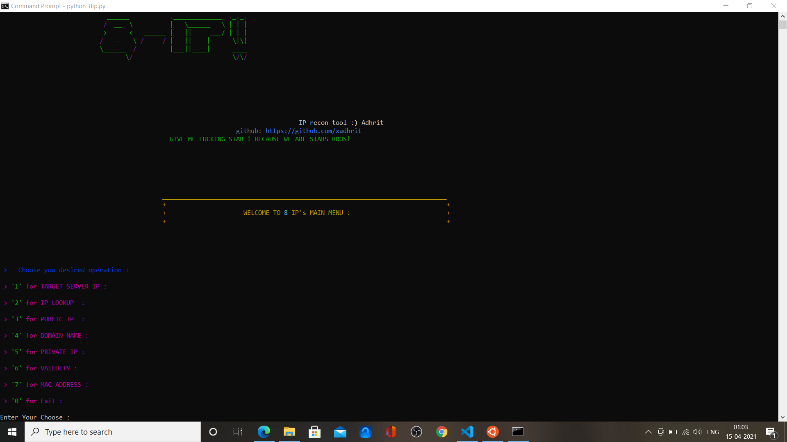
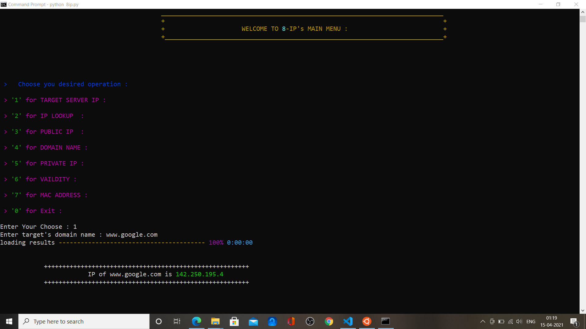
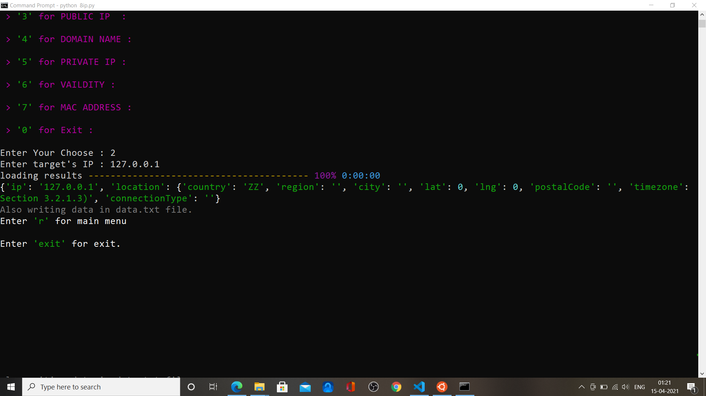
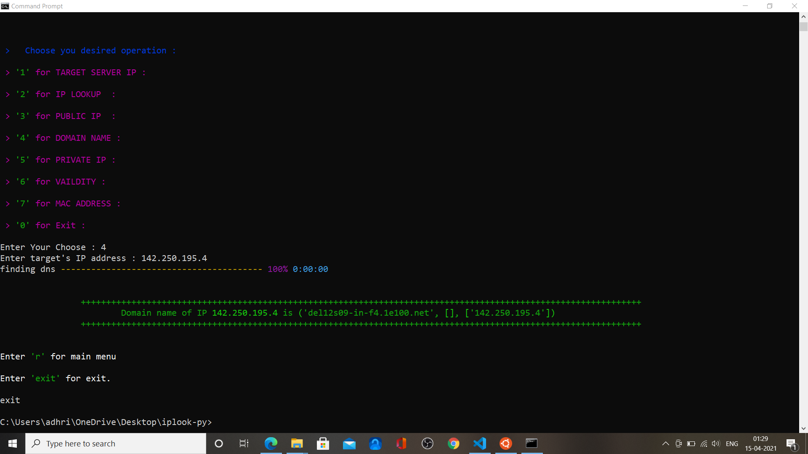
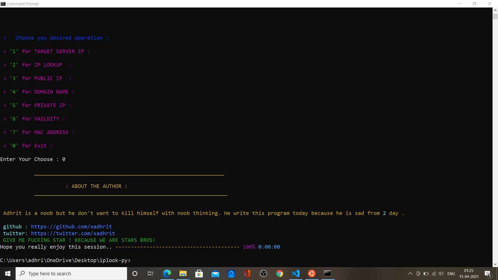

##                                                         8-IP (IP Playground)

Command Line tool for finding IP address, Domain Names, Location and whole Look up service, Mac Address of device, Your Private Ip address and Public Visible Address.

### I have written 'choose' for choice , so don't be confused folks.

## Installation Process

```console

# clone repo

$ ~  git clone https://github.com/xadhrit/8IP.git

# change directory

$ ~ cd 8IP 

# install all  required libraries

# on Linux

$ ~ python3 -m pip install -r requirements.txt 

# on Windows

>   python -m pip install -r requirements.txt

```

## Usage

<p align="center" >
  
</p>

```console

#linux Users

$~ python3 8ip.py

# Windows Users

> python 8ip.py

```
#### Docs

Enter Following option give following results

1.  Option '1': for finding a remote server IP address

2.  Option '2': for lookup of an IP(using apiKey from 'https://ip-geolocation.whoisxmlapi.com/', you can grab one for yourself also.) 

3.  Option '3': for Finding your Public IP addr

4.  Option '4': for Finding your Domain Server Name from an IP addr

5.  Option '5' : for Your Machine's Local IP (private IP)

6.  Option '6' : for checking if a IP address is really valid or not (running through socket search)

7.  Option '7': for Getting your Media Access Control (MAC) address, which is a unique identifier assigned to a network interface controller (NIC) for use as a network address in communications within a network segment.

0. Option '0':  for Reading 2 lines about me and Exiting the Program.

### ScreenShots

<p align='center'>

</p>

<p align='center'>

</p>

<p align='center'>

</p>

<p align='center'>

</p>


Thanks for reading.


